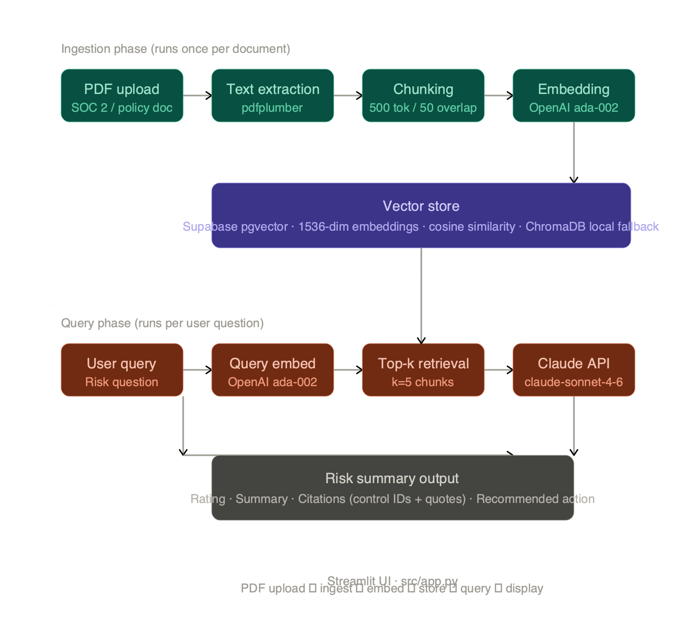

# Vendor Risk Assessment Tool

**[Try the live demo](https://vendor-risk-rag.streamlit.app/)** · **[Loom walkthrough](#)** *(coming soon)*

---

## The problem

Reviewing vendor security posture means reading dense, lengthy documents — audit reports, security questionnaires, privacy policies — to extract a handful of actionable findings. In practice, this means hours of low-ROI searching through compliance language to answer questions that should take minutes. The relevant sections are buried, exceptions are easy to miss, and the output is usually a manual summary with no citations.

SOC 2 Type II reports are a prime example: comprehensive independent audits that verify a company's ability to securely manage customer data, but structured for auditors rather than for the reviewers who need to act on them quickly.

This tool converts that process into a structured, cited risk assessment in seconds.

---

## What it does

Upload a vendor security document. Ask a risk question in plain English. Get back:

- A **risk rating** (Low / Medium / High / Critical)
- A **summary** of the finding
- **Direct citations** to the source document — specific control IDs and quoted text
- A **recommended action** for the reviewer

The tool works against any PDF vendor document: SOC 2 Type I or II reports, security questionnaires (VSA, SIG, CAIQ), and vendor privacy policies or data processing agreements.

---

## Live demo

**[vendor-risk-rag.streamlit.app](https://vendor-risk-rag.streamlit.app/)**

Click "Try with sample document" to load a realistic synthetic SOC 2 Type II report (NovaSoft Technologies, 20 controls, 2 intentional exceptions) and run any of the suggested queries — no account or upload required.



---

## How it works

This is a RAG (Retrieval-Augmented Generation) pipeline built without framework abstractions. Each step is a discrete, readable module.

**Ingestion phase (runs once per document):**
1. `src/ingest.py` — extracts text from the PDF using `pdfplumber` and chunks it with LangChain's `RecursiveCharacterTextSplitter` (500 token chunks, 50 token overlap)
2. `src/embed.py` — embeds each chunk using OpenAI `text-embedding-ada-002` (1536-dimensional vectors)
3. `src/vectorstore.py` — stores embeddings in Supabase pgvector with a dedicated `document_chunks` table and cosine similarity index

**Query phase (runs per question):**
1. The user's question is embedded with the same ada-002 model
2. Top-5 most semantically similar chunks are retrieved from pgvector
3. Retrieved chunks are passed as context to Claude (`claude-sonnet-4-6`) with a prompt that enforces citation grounding and structured output
4. The response is parsed into risk rating, summary, citations, and recommended action

**Why manual over a framework:** Using raw API calls instead of LangChain or LlamaIndex makes every step of the pipeline visible and explainable — important for a tool used in compliance and audit contexts.

---

## RAG architecture


The diagram above shows the two-phase pipeline. Key design decisions:

- **Chunking:** Sentence-aware with overlap rather than fixed-size, to avoid splitting mid-clause in dense regulatory language
- **Embedding:** OpenAI ada-002 for battle-tested retrieval quality at negligible cost (~fractions of a cent per document)
- **Vector store:** Supabase pgvector in production; ChromaDB local persistence for development (auto-detected from `.env`)
- **Citation grounding:** The system prompt explicitly instructs Claude to cite control IDs and quote source text — and to flag when retrieved context is insufficient rather than hallucinate

---

## Known limitations

**Query wording affects retrieval quality.** The retrieval layer matches semantic similarity — queries using language closer to the source document surface better chunks. For example, "What penetration test findings are open or overdue?" outperforms "What security issues exist?" for surfacing a specific pen test exception. The suggested questions in the UI are tuned for the SOC 2 format.

**Top-k retrieval can miss context.** With k=5, long exception narratives that span multiple chunks may be partially retrieved. Re-querying with more specific terms surfaces additional context.

**LLM-as-judge limitations.** The risk rating is generated by Claude based on retrieved context — it is not a deterministic scoring function. The same document queried differently may return different ratings. This is expected behavior for a retrieval-based system.

---

## Sample output

See [`sample_data/sample_output.json`](sample_data/sample_output.json) for a full structured output example against the NovaSoft SOC 2 report.

**Query:** "What penetration test or vulnerability findings are open or overdue?"

```json
{
  "query": "What penetration test or vulnerability findings are open or overdue?",
  "risk_rating": "High",
  "summary": "NovaSoft has an open High-severity penetration test finding under control CC7.1...",
  "citations": "CC7.1: 'The October 2024 penetration test identified one High-severity finding: insufficient rate limiting on the authentication API endpoint...'",
  "recommended_action": "Obtain written confirmation that the rate-limiting fix was deployed to production by the stated February 20, 2025 target date...",
  "chunks_used": 5
}
```

---

## Running locally

**Prerequisites:** Python 3.11+, OpenAI API key, Anthropic API key

```bash
git clone https://github.com/Schoobert/build3-vendor-risk-rag.git
cd build3-vendor-risk-rag
python3 -m venv venv
source venv/bin/activate
pip install -r requirements.txt
cp .env.example .env
# Add your API keys to .env
streamlit run src/app.py
```

The app defaults to ChromaDB local storage if Supabase credentials are not set. To use pgvector, add your Supabase URL and anon key to `.env`.

---

## Production considerations

This is a single-user demo build. Moving to production would require:

- **Authentication and multi-tenancy** — currently any user can query any document in the shared vector store. Production would require per-user or per-organization isolation, row-level security keyed to authenticated users, and proper session management
- **API key security** — keys are currently stored in `.env` and Streamlit secrets. Production would use a secrets manager (AWS Secrets Manager, HashiCorp Vault) with key rotation
- **Token cost scaling** — embedding a SOC 2 report costs fractions of a cent. At volume (hundreds of documents, thousands of queries), OpenAI and Anthropic costs grow linearly and should be modeled and cached
- **Supabase free tier limitations** — the free tier pauses inactive projects after one week. Production would require a paid Supabase plan or a self-hosted pgvector instance
- **Chunking strategy** — the current sentence-aware chunking works well for SOC 2 reports. Structure-aware chunking (splitting on document headers and control IDs) would improve retrieval precision for heavily structured audit documents
- **Scraper and document freshness** — vendor documents change. Production would need a refresh mechanism to re-ingest updated versions and invalidate stale embeddings

---

## What I learned

- **RAG retrieval quality is more about query design than model capability.** The most impactful improvements came from tuning suggested query wording to match source document language, not from changing models or parameters
- **Citation grounding requires explicit prompt engineering.** Without specific instructions to cite control IDs and quote source text, Claude produces accurate but ungrounded summaries — usable for personal review but not defensible in an audit context
- **Manual pipelines beat frameworks for explainability.** Building each step as a discrete module (ingest → embed → store → retrieve → summarize) made the system easier to debug, extend, and explain in interviews than a LangChain abstraction would have
- **pgvector on Supabase is production-credible at zero cost.** The free tier covers demo and personal use; the architecture is identical to what a production deployment would use

---

## Tech stack

| Component | Tool |
|---|---|
| PDF parsing | pdfplumber |
| Chunking | LangChain RecursiveCharacterTextSplitter |
| Embeddings | OpenAI text-embedding-ada-002 |
| Vector store (production) | Supabase pgvector |
| Vector store (local dev) | ChromaDB |
| LLM | Anthropic claude-sonnet-4-6 |
| UI | Streamlit |
| Language | Python 3.11 |
